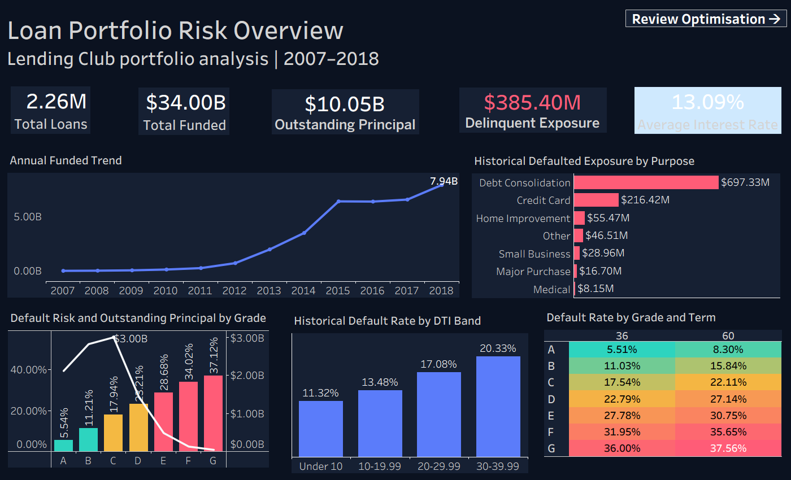
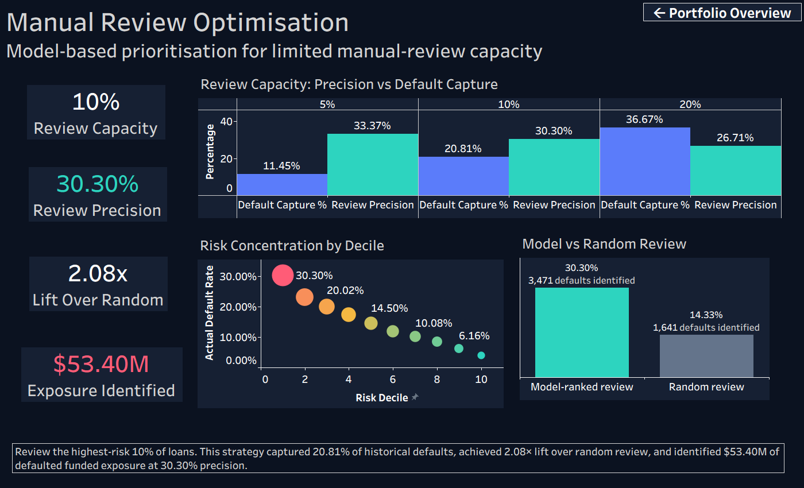

# Lending Club Credit Risk Analytics

## Project overview

This project analyses 2.26 million Lending Club loans issued between 2007 and 2018. I developed the project in Databricks using PySpark, Spark SQL and Spark ML, and created two interactive dashboards in Tableau Public.

The main aim was to investigate how a lender could use limited manual-review capacity more effectively. Instead of reviewing loans randomly, I used a Logistic Regression model to rank completed loans by their estimated probability of default. I then measured the results when only the highest-risk 5%, 10% or 20% of loans could be reviewed.

The model is used as a prioritisation tool, not as an automatic loan approval or rejection system.

## Business problem

A lending company may not have enough staff to manually examine every loan in detail. The analysis therefore addresses two related questions:

1. Which parts of the loan portfolio create the greatest risk and financial exposure?
2. Can a model-ranked review queue identify more historical defaults than random review at the same capacity?

## Tools used

- **Databricks Free Edition** – project development and data processing
- **PySpark** – data cleaning, validation and feature engineering
- **Spark SQL** – portfolio and historical risk analysis
- **Delta tables** – storage of the prepared analysis datasets
- **Spark ML** – Logistic Regression model and risk probabilities
- **Tableau Public** – interactive portfolio and review-strategy dashboards
- **GitHub** – project documentation and version control

## Dataset

The project uses the Lending Club loan dataset available through Kaggle. The original file contains:

- **2,260,668 rows**
- **145 columns**
- Loans issued from **2007 to 2018**

The raw dataset is not included in this repository because of its size and Kaggle's distribution conditions.

Two analysis populations were created:

- **Complete portfolio:** 2,260,668 valid loans used for portfolio monitoring.
- **Mature outcome population:** 572,994 loans whose scheduled term and additional three-month outcome window had ended. These loans were used for historical risk analysis and modelling.

The maturity rule reduces the bias that would result from training a model on recent loans that had not been observed for enough time.

## Project workflow

```text
Lending Club CSV
        ↓
Databricks Volume
        ↓
PySpark validation, cleaning and feature engineering
        ↓
Delta tables for portfolio and mature loan outcomes
        ↓
Spark SQL business analysis
        ↓
Logistic Regression risk ranking
        ↓
Manual-review capacity evaluation
        ↓
Tableau dashboards
```

## Data preparation

The main preparation steps were:

- Checked dataset size, column types, duplicate rows and loan-status values.
- Selected variables needed for portfolio reporting and risk analysis.
- Replaced missing employment length with `Unknown`.
- Filled the small number of missing DTI, revolving utilisation and enquiry values using their medians.
- Converted loan term and date fields into analysis-ready formats.
- Created broader status groups for current, delinquent, fully paid and defaulted loans.
- Excluded payment, recovery and final-outcome fields from model features to prevent data leakage.
- Created a mature-loan population using issue date, loan term and a three-month outcome window.

## SQL business questions

The Spark SQL analysis answers six questions:

1. What is the size and current risk position of the portfolio?
2. Which grades combine higher historical default risk with substantial exposure?
3. Does loan term affect default risk within each grade?
4. Which loan purposes create the greatest risk and exposure?
5. How did lending activity change over time?
6. How is borrower debt burden related to default risk?

The queries are available in [`sql/business_analysis.sql`](sql/business_analysis.sql).

## Main portfolio findings

- The portfolio contains **2.26 million loans** with a total funded value of approximately **$34.00 billion**.
- Approximately **$10.05 billion** of principal was outstanding at the end of the dataset.
- There were **34,586 delinquent loans** with approximately **$385.40 million** in outstanding exposure.
- Delinquent loans represented around **1.53% of portfolio loans** but **3.83% of outstanding principal**, showing that their average outstanding balance was comparatively high.
- Historical default rate increased from **5.54% for Grade A** to **37.12% for Grade G**.
- Grade C had approximately **$3.00 billion in outstanding principal**, making it more important at portfolio level than the smaller high-risk grades.
- Within every grade, 60-month loans had a higher historical default rate than 36-month loans.
- Debt-consolidation loans produced approximately **$697.33 million** in historical defaulted funded exposure because of their large volume.
- Historical default rate increased from **11.32% for DTI below 10** to **20.33% for DTI between 30 and 39.99**.

## Model development

I trained a Logistic Regression model using an 80% training and 20% testing split. Numerical and categorical borrower features available at or close to loan origination were used.

The model produced the following test results:

| Metric | Result |
|---|---:|
| ROC-AUC | 0.679 |
| PR-AUC | 0.255 |
| Random PR baseline | 0.146 |

The results indicate moderate risk-ranking ability. They are useful for prioritising manual reviews but are not sufficient for fully automated credit decisions.

## Manual-review results

The test loans were ranked from highest to lowest predicted risk. I then simulated different review-team capacities.

| Review capacity | Loans reviewed | Review precision | Defaults captured | Default capture rate | Lift over random | Defaulted exposure identified |
|---:|---:|---:|---:|---:|---:|---:|
| 5% | 5,727 | 33.37% | 1,911 | 11.45% | 2.29× | $31.32M |
| 10% | 11,454 | 30.30% | 3,471 | 20.81% | 2.08× | $53.40M |
| 20% | 22,908 | 26.71% | 6,118 | 36.67% | 1.83× | $88.38M |

At 10% capacity, a random review sample identified 1,641 defaults at 14.33% precision. The model-ranked strategy identified 3,471 defaults at 30.30% precision without increasing the number of loans reviewed.

## Recommendation

Based on this analysis, I would use the highest-risk 10% as the initial manual-review queue. This option provides a practical balance between review workload and risk coverage:

- **20.81%** of historical defaults captured
- **30.30%** review precision
- **2.08×** lift over random review
- **$53.40 million** in defaulted funded exposure identified

This strategy should support underwriters by helping them decide where to focus their attention. It should not replace affordability checks, policy rules or human judgement.

## Tableau data preparation

The Tableau dashboards were built using small aggregated CSV files created from the prepared Delta tables in Databricks.

The dashboard data followed this process:

```text
Raw Lending Club CSV
        ↓
PySpark cleaning in Databricks
        ↓
Delta tables
        ↓
Spark SQL aggregations
        ↓
Dashboard CSV exports
        ↓
Tableau Public dashboards
```

The files in `data/dashboard_exports/` contain only summarised results, including portfolio KPIs, grade and term risk, purpose exposure, DTI bands, annual lending activity, model risk deciles and review-capacity results.

The original loan-level dataset is not included because it is approximately 1.1 GB. The aggregated files are included so that the source of each Tableau visual can be reviewed and the dashboards can be reproduced.

## Dashboards

### Loan Portfolio Risk Overview



### Manual Review Optimisation



Explore the interactive dashboards on [Tableau Public](https://public.tableau.com/app/profile/aishwarya.srivastava4872/viz/Lending_Club_Credit_Risk_Analytics/PortfolioRiskOverview).

The packaged Tableau workbook is also available at [`tableau/Lending_Club_Credit_Risk_Analytics.twbx`](tableau/Lending_Club_Credit_Risk_Analytics.twbx). It contains both dashboards, their worksheets, calculated fields, formatting and the embedded aggregated data extracts.

## Repository structure

```text
lending-club-credit-risk-analytics/
├── README.md
├── notebooks/
│   └── credit_risk_portfolio_analysis.ipynb
├── sql/
│   └── business_analysis.sql
├── data/
│   └── dashboard_exports/
│       ├── portfolio_kpis.csv
│       ├── grade_summary.csv
│       ├── grade_term_summary.csv
│       ├── purpose_summary.csv
│       ├── dti_summary.csv
│       ├── yearly_lending.csv
│       ├── review_capacity.csv
│       ├── risk_deciles.csv
│       └── model_vs_random.csv
├── tableau/
│   └── Lending_Club_Credit_Risk_Analytics.twbx
├── images/
│   ├── portfolio_risk_overview.png
│   └── review_optimisation.png
├── LICENSE
└── .gitignore
```

## Limitations

- The analysis uses historical Lending Club data and may not represent the lending market today.
- The model was trained only on mature loans with known outcomes, not active loans.
- Funded amount is used as an exposure measure and does not represent the lender's final net loss after repayments or recoveries.
- The model does not include all information that would be available in a real underwriting process.
- Model performance should be monitored over time before any operational use.
- Fair-lending, explainability and regulatory checks would be required before using a credit-risk model in practice.

## Author

**Aishwarya Srivastava**
